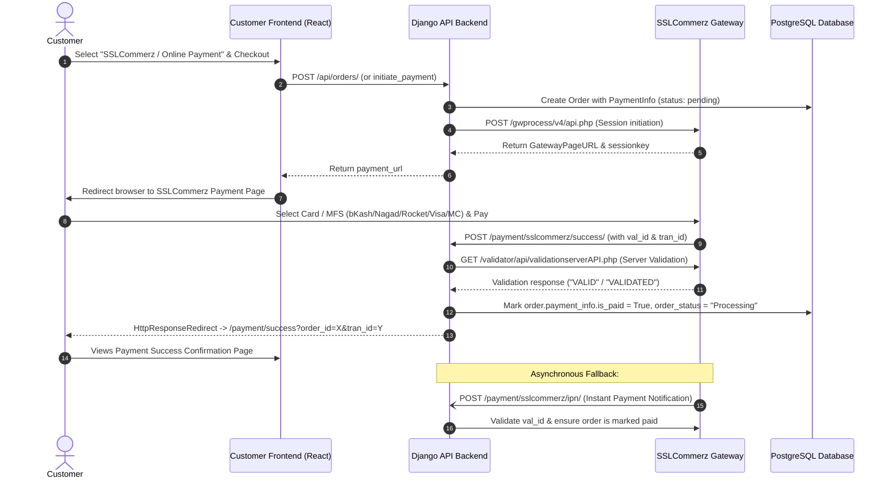

# 💳 SSLCommerz Payment Gateway — Production Integration Guide

This guide explains step-by-step how to configure, test, and deploy the **SSLCommerz** payment gateway integration in **Production** for this e-commerce platform.

---

## Table of Contents

1. [Architecture & Payment Flow](#1-architecture--payment-flow)
2. [Prerequisites for Production](#2-prerequisites-for-production)
3. [Environment Configuration (`.env`)](#3-environment-configuration-env)
4. [Endpoints & Callback Routing](#4-endpoints--callback-routing)
5. [SSLCommerz Merchant Dashboard Settings](#5-sslcommerz-merchant-dashboard-settings)
6. [Nginx & Reverse Proxy Requirements](#6-nginx--reverse-proxy-requirements)
7. [Deployment & Verification Steps](#7-deployment--verification-steps)
8. [Security & Validation Details](#8-security--validation-details)
9. [Troubleshooting & Common Pitfalls](#9-troubleshooting--common-pitfalls)

---

## 1. Architecture & Payment Flow

Our payment system uses a 2-step verification mechanism ensuring no order is marked as paid without cryptographic/server-side validation by SSLCommerz.



---

## 2. Prerequisites for Production

Before going live, ensure you have:

1. **Approved SSLCommerz Live Merchant Account**:
   - **Live Store ID** (`Store ID` from SSLCommerz merchant portal).
   - **Live Store Password** (`Store Password` provided via email / merchant credentials).
2. **Public Domain with HTTPS (SSL Certificate)**:
   - SSLCommerz live gateway **requires HTTPS** for all callback and redirect URLs.
   - Example: `https://yourdomain.com` (Frontend) and `https://api.yourdomain.com` (Backend) or reverse-proxied under same domain.
3. **Valid Merchant Dashboard Access**:
   - Access to [SSLCommerz Merchant Panel](https://merchant.sslcommerz.com/).

---

## 3. Environment Configuration (`.env`)

Add or update the following variables in the root `.env` file (or your server environment configuration):

### Production Configuration Example

```env
# =============================================================
# SSLCOMMERZ PRODUCTION SETTINGS
# =============================================================
# Set to False for LIVE production mode (True = Sandbox)
SSLCOMMERZ_IS_SANDBOX=False

# Live Merchant credentials from SSLCommerz
SSLCOMMERZ_STORE_ID=your_live_store_id_here
SSLCOMMERZ_STORE_PASSWD=your_live_store_password_here

# Backend public base URL (used to generate callback URLs for SSLCommerz)
# IMPORTANT: Must be HTTPS in production and include NO trailing slash
BACKEND_URL=https://api.yourdomain.com

# Frontend public base URL (used for browser redirects after payment)
# IMPORTANT: Must be HTTPS in production and include NO trailing slash
FRONTEND_URL=https://yourdomain.com
```

### Sandbox vs. Production Comparison

| Variable | Sandbox (Testing) | Production (Live) |
|---|---|---|
| `SSLCOMMERZ_IS_SANDBOX` | `True` | `False` |
| `SSLCOMMERZ_STORE_ID` | Sandbox Store ID (e.g. `testbox_...`) | Live Store ID issued by SSLCommerz |
| `SSLCOMMERZ_STORE_PASSWD` | Sandbox Password | Live Password |
| Gateway URL | `https://sandbox.sslcommerz.com/gwprocess/v4/api.php` | `https://securepay.sslcommerz.com/gwprocess/v4/api.php` |
| Validation API URL | `https://sandbox.sslcommerz.com/validator/api/...` | `https://securepay.sslcommerz.com/validator/api/...` |
| `BACKEND_URL` | `http://localhost:8002` (or ngrok) | `https://api.yourdomain.com` (HTTPS mandatory) |
| `FRONTEND_URL` | `http://localhost:5175` | `https://yourdomain.com` (HTTPS mandatory) |

---

## 4. Endpoints & Callback Routing

All callback URLs are registered in [`backend/orders/urls.py`](file:///f:/my_project/drpython-ecommerce/backend/orders/urls.py) and generated dynamically by [`backend/orders/sslcommerz.py`](file:///f:/my_project/drpython-ecommerce/backend/orders/sslcommerz.py):

| Purpose | Backend Endpoint (SSLCommerz calls) | Frontend Redirect (User sees) |
|---|---|---|
| **Payment Success** | `POST /payment/sslcommerz/success/` | `GET ${FRONTEND_URL}/payment/success?order_id=X&tran_id=Y` |
| **Payment Failed** | `POST /payment/sslcommerz/fail/` | `GET ${FRONTEND_URL}/payment/failed?order_id=X&reason=payment_failed` |
| **Payment Cancelled** | `POST /payment/sslcommerz/cancel/` | `GET ${FRONTEND_URL}/payment/cancelled?order_id=X&tran_id=Y` |
| **Instant Payment Notification (IPN)** | `POST /payment/sslcommerz/ipn/` | *None (Server-to-server webhook, responds with JSON)* |

> [!IMPORTANT]
> The endpoints are registered **without** the `/api/orders/` prefix. The actual path is `/payment/sslcommerz/...`. Do not alter this prefix unless you also update [`orders/urls.py`](file:///f:/my_project/drpython-ecommerce/backend/orders/urls.py).

---

## 5. SSLCommerz Merchant Dashboard Settings

Log in to the [SSLCommerz Merchant Panel](https://merchant.sslcommerz.com/) and verify the following settings:

1. **IPN (Instant Payment Notification) URL**:
   - Go to **My Stores** → select your Store → **IPN Settings**.
   - Set IPN HTTP/HTTPS URL to:
     ```text
     https://api.yourdomain.com/payment/sslcommerz/ipn/
     ```
   - Set IPN Method to: **POST**.
   - Enable IPN status: **Active**.

2. **Domain Whitelisting**:
   - In **Store Settings**, ensure your live domain `yourdomain.com` and `api.yourdomain.com` are registered under the store profile.

3. **Currency & Payment Methods**:
   - Verify that BDT currency is active.
   - Confirm with SSLCommerz account manager that your channels are active:
     - Cards (Visa, Mastercard, Amex, UnionPay)
     - Mobile Banking (bKash, Nagad, Rocket, Upay, etc.)
     - Internet Banking (City Touch, Islami Bank, etc.)

---

## 6. Nginx & Reverse Proxy Requirements

In production, SSLCommerz calls your backend callbacks via HTTP `POST`. Your reverse proxy (Nginx / Cloudflare / Traefik) must meet the following criteria:

### 1. Preserve HTTP Method & Body on Callbacks
Never issue a 301/302 redirect from `http://` to `https://` on POST endpoints, as that causes HTTP clients to downgrade `POST` to `GET` and discard the POST body (`val_id`, `tran_id`). Always use HTTPS everywhere.

### 2. Forwarded Headers
Ensure your Nginx configuration passes host and proto headers properly:

```nginx
location /payment/sslcommerz/ {
    proxy_pass http://backend_api:8000;
    proxy_set_header Host $host;
    proxy_set_header X-Real-IP $remote_addr;
    proxy_set_header X-Forwarded-For $proxy_add_x_forwarded_for;
    proxy_set_header X-Forwarded-Proto $scheme;
    
    # Increase timeout for validation requests
    proxy_connect_timeout 60s;
    proxy_read_timeout 60s;
}
```

### 3. Django Security Settings (`settings.py`)
Ensure your live settings include:

```python
ALLOWED_HOSTS = ['yourdomain.com', 'api.yourdomain.com', 'localhost']

CSRF_TRUSTED_ORIGINS = [
    'https://yourdomain.com',
    'https://api.yourdomain.com',
    'https://securepay.sslcommerz.com',
]

SECURE_PROXY_SSL_HEADER = ('HTTP_X_FORWARDED_PROTO', 'https')
```

*(Note: The callback views are decorated with `@csrf_exempt` so SSLCommerz POST requests will not fail CSRF validation, but having `CSRF_TRUSTED_ORIGINS` configured is standard best practice).*

---

## 7. Deployment & Verification Steps

Follow these steps when moving to production:

### Step 1: Update `.env` on the Production Server

```bash
# Edit server .env
nano .env
```

Ensure:
```env
SSLCOMMERZ_IS_SANDBOX=False
SSLCOMMERZ_STORE_ID=<your_live_store_id>
SSLCOMMERZ_STORE_PASSWD=<your_live_store_password>
BACKEND_URL=https://api.yourdomain.com
FRONTEND_URL=https://yourdomain.com
```

### Step 2: Rebuild & Restart the Backend Containers

For code or environment variable changes to take effect:

```bash
docker compose up -d --build backend_api backend_ws
```

### Step 3: Verify the Running Configuration

Check logs to verify the container started cleanly:

```bash
docker logs gurudeb_backend_api --tail 50
```

### Step 4: Perform a Live End-to-End Test

1. Create a test product with a small price (e.g., 10 BDT or 20 BDT).
2. Go to the live storefront (`https://yourdomain.com`), add the product to cart, and proceed to checkout.
3. Choose **SSLCommerz** as the payment method and click **Place Order / Pay Now**.
4. Confirm you are redirected to the **Live SSLCommerz Gateway** (`https://securepay.sslcommerz.com/...`).
5. Complete payment using a real card or bKash/Nagad wallet.
6. Verify:
   - You are redirected back to `https://yourdomain.com/payment/success?order_id=...`.
   - The order status in database is updated to `processing`.
   - `order.payment_info.is_paid` is `True`.
   - The cart is emptied.
   - Admin dashboard displays the order with correct transaction ID and paid status.

---

## 8. Security & Validation Details

### Dual Verification Safeguards
1. **Server-Side Validation**:
   - Even though SSLCommerz POSTs `status="VALID"`, our backend **never trusts client/browser data blindly**.
   - [`sslcommerz_success_view`](file:///f:/my_project/drpython-ecommerce/backend/orders/views.py#L466) takes the `val_id` and performs a secure back-channel GET request to SSLCommerz's Order Validation API:
     ```python
     validated_data = client.validate_payment(val_id)
     ```
   - Only when SSLCommerz's validation server responds with `status: "VALID"` or `"VALIDATED"` is the order marked paid.

2. **IPN Webhook Redundancy**:
   - If a customer pays successfully but accidentally closes their browser tab or suffers a connection drop before the browser redirect finishes, SSLCommerz's server will ping the IPN endpoint:
     ```
     POST /payment/sslcommerz/ipn/
     ```
   - The [`sslcommerz_ipn_view`](file:///f:/my_project/drpython-ecommerce/backend/orders/views.py#L577) processes the notification, validates `val_id`, and safely updates the order in the background.

---

## 9. Troubleshooting & Common Pitfalls

| Issue | Likely Cause | Solution |
|---|---|---|
| **"Store Credential is not valid"** | Using sandbox credentials with `SSLCOMMERZ_IS_SANDBOX=False`, or live credentials with `SSLCOMMERZ_IS_SANDBOX=True`. | Ensure `SSLCOMMERZ_IS_SANDBOX` matches the type of credentials provided by SSLCommerz. |
| **Callback returns 404** | `BACKEND_URL` is configured incorrectly or route has `/api/orders/` prefix. | Confirm `BACKEND_URL=https://api.yourdomain.com` without trailing slash, and routes point to `/payment/sslcommerz/...`. |
| **Browser stuck on redirect to localhost** | `FRONTEND_URL` in `.env` is still set to `http://localhost:5175`. | Update `FRONTEND_URL=https://yourdomain.com` and restart backend container. |
| **Payment completes but order remains "Pending"** | SSLCommerz cannot reach your `BACKEND_URL` for validation or IPN callback. | Verify firewall, DNS, and ensure `BACKEND_URL` is publicly accessible over the internet via HTTPS. |
| **"Session was not created" / GatewayPageURL empty** | Missing required customer fields (e.g. invalid phone number format or empty address). | Check Django backend logs: `docker logs gurudeb_backend_api --tail 100` to inspect the exact `failedreason` returned by SSLCommerz. |
| **Order item amounts mismatch** | `total_amount` sent to SSLCommerz does not match `order.grand_total`. | Amount is rounded to 2 decimal places (`f"{total_amount:.2f}"`). Ensure shipping/discounts are included in `order.grand_total`. |

---

## 10. Support & Contacts

- **SSLCommerz Integration Support**: `integration@sslcommerz.com`
- **SSLCommerz Merchant Support**: `operation@sslcommerz.com`
- **Developer Documentation**: [https://developer.sslcommerz.com/doc/v4.00/](https://developer.sslcommerz.com/doc/v4.00/)
